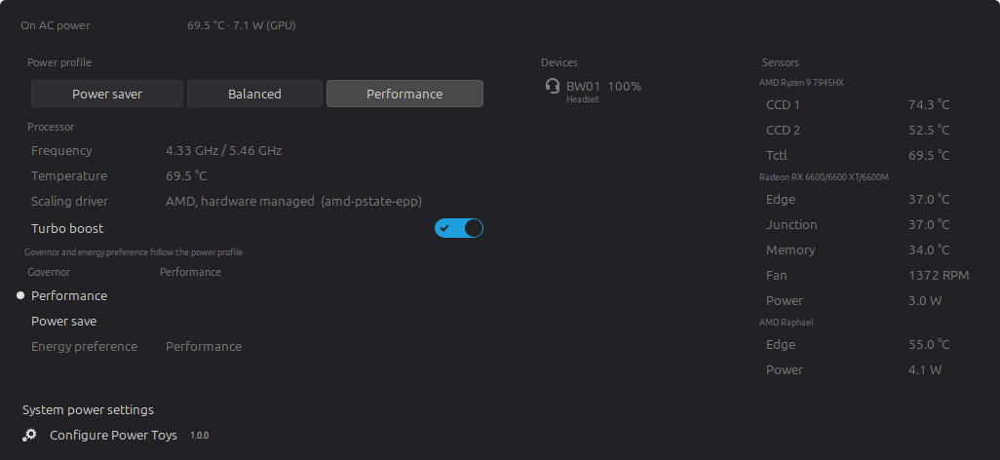

# Cinnamon Power Toys

A Cinnamon applet that puts a single power icon in the panel and, from one
menu, monitors and configures power management for the whole machine.

One strip across the top says what the machine is running on, then a
brightness slider per screen, then two columns: the left is how hard the
machine is being asked to work — **Power profile**, **Processor**,
**Devices** — and the right is what that is doing to it, **Sensors**. Nothing
is folded away, and every figure is stated once.



The panel item, between the other applets:


Taken on a desktop, so three things are missing because that machine does not
have them or cannot reach them: the charger row, which needs a UPower line
power device; the backlight sliders, because there is no kernel backlight; and
the monitor slider, because the account was not in the `i2c` group when the
session started — see
[External monitor brightness](#external-monitor-brightness). All of them hide
themselves rather than sitting there empty.

## Features

**Batteries, every device type.** Everything UPower knows about is listed, not
just the laptop battery: mice, keyboards, headsets, game controllers, phones,
tablets, UPS units, styluses. Each row shows charge, state, time remaining,
draw in watts, voltage, temperature, health (capacity versus design capacity)
and charge cycles when the device reports them. Devices that only report a
coarse level (low / normal / high) are shown that way instead of a fake
percentage. Chargers are listed above them, by model where UPower knows it,
so whether the machine is on the cable is the first line under *Devices*.
Connected bluetooth devices are read from BlueZ as well as from UPower, which
does not bridge all of them, and where nothing is connected the group says so
in words rather than being empty.

**Brightness.** Screen and keyboard backlight sliders at the top of the menu,
driven through `org.cinnamon.SettingsDaemon.Power.Screen` and `.Keyboard`, so
the wheel over one moves in the same steps the brightness keys do. A machine
with no backlight of its own — a desktop, or a laptop with the lid shut on an
external screen — gets one slider per monitor instead, over DDC/CI through
`ddcutil`, each named after the monitor it moves: make and model out of the
EDID, the socket appended where two monitors are the same model. Up to ten,
and past that a line saying so rather than nothing. Plugging a monitor in or
unplugging one is looked for and the sliders follow, which is the only time
the I2C bus is disturbed for that — probing wakes a sleeping monitor, so it is
not done on a timer. The wheel over the panel icon has no monitor in mind and
so still moves all of them together. Each slider is hidden where there is
nothing behind it.

**Power profiles.** Reads and switches profiles through power-profiles-daemon
(both the `net.hadess.PowerProfiles` and `org.freedesktop.UPower.PowerProfiles`
names are supported). Shows when the firmware degrades performance and which
application is holding a profile. On machines without the daemon it falls back
to the ACPI platform profile in `/sys/firmware/acpi/platform_profile`.

**CPU.** Current and maximum frequency, scaling driver (including the
`amd_pstate` mode) and turbo boost, with the governor and the energy
performance preference behind *Advanced*. Those two are what a power profile
sets, so where power-profiles-daemon is running *Advanced* says so: without
that line the profile and the two settings under it read the same word for no
stated reason, which looks like three copies of one control rather than one
control and its two outputs. They stay changeable — a governor set by hand
holds until the next profile change or mains transition — but nothing pretends
the daemon has stopped writing them. Where a setting has only one value to
offer, and `amd_pstate` narrows the energy preferences to exactly one, it is
shown as a value rather than as a choice of one. Governor, energy preference,
boost and the battery charge limit are kernel owned, so they are applied
through a small validating helper launched with `pkexec`.

**Temperature and power.** Every hwmon and thermal zone sensor plus fan speeds,
hwmon power meters (for example the amdgpu GPU package power), RAPL package
power when the kernel allows reading it, and what the batteries report about
themselves. Readings are grouped by the thing they came off and it is named
rather than addressed: the processor from `/proc/cpuinfo`, anything on the PCI
bus from `pci.ids`, a battery by what UPower calls it. So two graphics cards
read as *Radeon RX 6600/6600 XT/6600M* and *AMD Raphael* rather than as
`03:00.0` and `08:00.0`, and the rows under each say only what they measure —
*Edge*, *Junction*, *Fan* — because the heading has already said whose they
are. The list can be limited to CPU and GPU only.

**Alerts.** Configurable low and critical battery notifications, separate
thresholds for peripherals, and an optional high temperature warning. All with
hysteresis, so a value sitting on the limit does not spam the tray.

**Panel.** Choose what appears next to the icon: battery percentage, power
draw, CPU frequency, active profile, any combination. Temperature is in the
tooltip and the menu rather than the panel, where a figure that moves every few
seconds pulls the eye without ever being worth acting on. The
icon follows the battery level, the active profile, or stays fixed. The wheel
over the applet changes screen brightness — every monitor together, since the
gesture names no screen — and a middle click toggles the keyboard backlight,
as they do on the applet this one can replace; either can be pointed at the
power profile instead, or switched off. Optional keyboard shortcuts to cycle
the profile and to open the menu.

## Install

```sh
./install.sh          # or: make install
```

On a first install, restart Cinnamon (`Alt+F2`, `r`, Enter) and enable **Power
Toys** from *Right click panel → Applets*. After that the script reloads the
running applet itself and says so, so an upgrade needs neither.

To remove it:

```sh
make uninstall
```

## Permissions

Reading is entirely unprivileged. Changing the CPU governor, energy preference,
turbo boost or charge limit writes to root owned files in `/sys`, so those
actions call `powertoys-helper` through `pkexec` and an administrator password
is requested. The helper accepts five fixed commands and validates every value
against the list the kernel advertises, so it cannot be used to write arbitrary
data. Turn the whole group off with *Allow changing CPU governor…* in the
applet settings if you would rather not be asked.

RAPL energy counters (`/sys/class/powercap/*/energy_uj`) are root-only on most
kernels since CVE-2020-8694. When they are unreadable the package power row is
simply not shown; battery draw and GPU power still work.

### One prompt instead of one per change

Out of the box every one of those changes asks for the password again, because
`pkexec` with no policy of its own never keeps an authorisation. Changing the
governor, the energy preference and the charge limit in one visit to the menu
is three prompts.

```sh
sudo make install-policy      # optional
```

That installs two files:

| file | what it is |
|------|------------|
| `/usr/share/polkit-1/actions/io.github.geraldo-netto.cinnamon-powertoys.policy` | the action |
| `/usr/local/lib/cinnamon-powertoys/powertoys-helper` | a root owned copy of the helper |

**What the action grants.** An administrator, logged in at the machine, may run
that one helper as root, and the authorisation is remembered for a few minutes
afterwards (`auth_admin_keep`) rather than for a single call. Anyone who is not
an administrator is still asked for an administrator password, and anyone
inactive or connected remotely gets no keeping at all. It grants nothing else:
the helper takes five fixed commands and checks every value against the list
the kernel itself advertises.

**Why the second file.** A kept authorisation applies to a path, so that path
must be one its caller cannot rewrite while the authorisation is still valid.
The copy inside the applet lives under your home directory; the action
deliberately names a root owned copy instead. Re-run `sudo make install-policy`
after upgrading the applet so the two stay the same script.

**To revoke it:**

```sh
sudo make uninstall-policy
```

Both files go, and the applet carries on asking for a password on every
change.

### External monitor brightness

A monitor on a cable has no kernel backlight. The only way to move it is DDC/CI
over the display's I2C channel, which means read and write on `/dev/i2c-*`, and
those are `root:i2c` on a stock install. Until your account is in that group the
slider does not appear at all: the applet probes, `ddcutil` finds no bus it may
open, and there is nothing to show. Nothing in the log says so either, because
`ddcutil` reports the refusal on its output and still exits 0.

```sh
sudo usermod -aG i2c $USER
```

Then **log out and back in**. A process's groups are fixed when it starts and
are never re-read, so a Cinnamon that was already running keeps the old set;
`Alt+F2`, `r` re-executes the same process and does not help either. To see
whether it will work without logging out first, `sg` runs one command with the
new group:

```sh
sg i2c -c "ddcutil detect"
```

```
Display 1
   I2C bus:          /dev/i2c-15
   DRM connector:    card2-HDMI-A-2
   Monitor:          DEL:U2419H:...
```

`No displays found` there means the group was not the problem: the monitor or
the cable does not carry DDC/CI. That is common over cheap HDMI adapters and on
most televisions, and there is nothing to be done about it from this end.

None of this is privileged in the way the CPU controls are — the applet spawns
`ddcutil` as you, not through `pkexec`. If you would rather not add the group,
turn the probe off with *Control external monitor brightness* in the applet
settings.

## Requirements

- Cinnamon 5.4 or newer. Only 6.6 has been run. The claim is kept honest by
  reading the Cinnamon sources rather than by trying it: whenever this applet
  starts using something of Cinnamon's that a 5.4 desktop might not have had,
  that call is looked up in the 5.4.0 sources before the change lands. Those
  are the ones named below; the rest of what an applet touches — a menu item,
  a separator, spawning a command — is older than any version this supports
  and is not tracked here.

  The xlet `require()` loader. `PopupMenuSection` and the fact that its actor
  *is* its box, which is what lets the two menu columns sit side by side.
  `PopupMenuBase.getColumnWidths` and `setColumnWidths`, which the columns
  override so their rows line up with themselves and not with the whole menu —
  and which the segmented profile control overrides for the opposite reason, so
  that a row spanning every column does not set the width of the first one.
  `PopupSubMenuMenuItem` and its `menu`, which is what *Advanced* is.
  `PopupSwitchMenuItem`, `PopupSliderMenuItem`, `PopupIconMenuItem`.
  `PopupBaseMenuItem`'s `{ activate: false, hover: false }`, which is how a row
  of buttons takes key focus without being a menu entry itself. `St.Button` and
  its `clicked`. `St.BoxLayout.add` with the `expand`, `x_fill` and `y_align`
  child properties. `addActor`, `removeActor`, `setShowDot`,
  `addSettingsAction`. Class-based applets, `AllowedLayout`,
  `set_show_label_in_vertical_panels`, `set_applet_icon_path`,
  `AppletSettings.bind`, `spawnCommandLineAsyncIO`. `Tooltips.Tooltip` with its
  `show` and `visible`. `keybindingManager.addHotKey`, `criticalNotify`.
  `Main.layoutManager`'s `monitors-changed`, which is when the monitor sliders
  are looked for again. And the `=` operator in a settings-schema `dependency`.
  All of them are in 5.4.0.

  Two things the applet leans on are not Cinnamon's at all and are older than
  any of this: `Gio.File.load_contents_async`, which takes the sensor reads off
  the compositor's thread, and `Gtk.IconTheme`'s `changed` signal.
- UPower, for battery and device data
- `xapp-symbolic-icons`, optional. Device and battery icons prefer that set,
  which Cinnamon's own power applet only started using in 6.6; where it is not
  installed the applet falls back to the freedesktop names every icon theme
  has carried for twenty years.
- `ddcutil`, optional, only for external monitor brightness, and it needs a
  group of its own before it works — see
  [External monitor brightness](#external-monitor-brightness). Never probed on
  a machine that has a backlight of its own, and can be turned off entirely
  with *Control external monitor brightness*
- `hwdata` or `pciutils`, optional, for `pci.ids` and `pnp.ids` — the tables
  that turn `03:00.0` into a graphics card and `DEL` into Dell. One or the
  other is installed almost everywhere, since `lspci` needs the first; without
  them a sensor group is headed by the driver's name and a monitor by its EDID
  code, which is what those were before
- power-profiles-daemon, optional, for profile switching
- polkit, optional, for the privileged controls

## Layout

```
cinnamon-powertoys@geraldo-netto/
├── applet.js            panel item, menu, polling, alerts
├── lib/io.js            file reads, rooted so a captured /sys can stand in
├── lib/hardware.js      what a chip, a card and a monitor are called
├── lib/sensors.js       hwmon, thermal and powercap discovery
├── lib/backlight.js     screen and keyboard backlight through csd
├── lib/ddc.js           external monitor brightness through ddcutil
├── lib/bluez.js         bluetooth batteries UPower does not bridge
├── lib/cpu.js           cpufreq scaling interface
├── lib/power-supply.js  charge limit and ACPI platform profile nodes
├── lib/upower.js        UPower D-Bus client
├── lib/profiles.js      power-profiles-daemon client
├── lib/device.js        what a powered device is, in words
├── lib/privileged.js    finding, running and queueing the pkexec helper
├── lib/format.js        value formatting and UPower enum naming
├── lib/gettext.js       the text domain, bound once
├── lib/log.js           the one thing in lib/ that knows about the shell
├── powertoys-helper     validating pkexec helper for root owned settings
├── metadata.json
├── settings-schema.json
├── stylesheet.css
├── po/                  the translation template and any translations
└── icons/

tests/                   harness, runner and the cases
tools/                   the loader emulation, parse check, translations
polkit/                  the action for one prompt instead of one per change
```

## Translating

Every string in the applet and in its settings goes through gettext, and
`cinnamon-powertoys@geraldo-netto/po/` holds the template they were extracted
into.

To start a language, copy the template and fill it in:

```sh
cd cinnamon-powertoys@geraldo-netto/po
msginit -l pt_BR -i cinnamon-powertoys@geraldo-netto.pot -o pt_BR.po
```

Then `./install.sh` or `make install`, which compiles every `.po` in that
directory into `~/.local/share/locale` where the applet looks for it.

After changing any translatable string, `make pot` regenerates the template;
`msgmerge -U <lang>.po cinnamon-powertoys@geraldo-netto.pot` carries an
existing translation onto it. Regenerating over unchanged sources produces the
same bytes — the extraction timestamp is stripped, deliberately, so that the
template is a function of the strings and the check below can be a plain
diff.

## Tests

```sh
make check            # parse check, tests, helper, JSON, polkit action
cjs tests/run.js      # tests only
cjs tests/run.js io   # only cases whose name contains "io"
```

On every push and pull request the same `make check` runs, then a staged
install of the applet and of the polkit action, then a check that the
translation template still matches the strings in the source — see
[.github/workflows/check.yml](.github/workflows/check.yml). None of it needs
Cinnamon, a session bus or real hardware, because the libraries take their
file root, their D-Bus calls and their spawns as parameters. It does need one
typelib, `gir1.2-upowerglib-1.0`, which the runner installs alongside `cjs`;
without it four of the libraries throw the moment they are loaded.

`tests/harness.js` loads the libraries exactly as Cinnamon does — strict mode,
the same export collection, a `require()` bound to the xlet directory — so a
test exercises what the shell actually runs. Cases live in `tests/cases/` and
are plain objects of named functions that throw; there is no registration and
no ordering.

## License

MIT, see [LICENSE](LICENSE).
