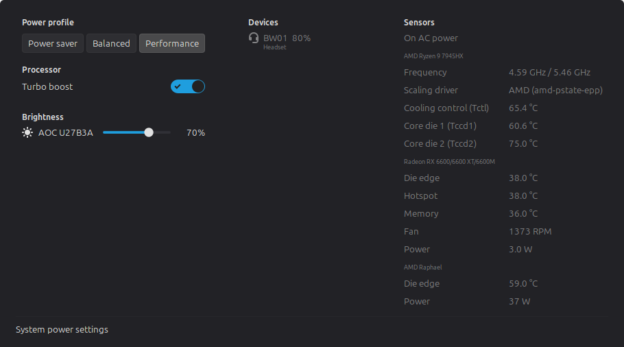

# Cinnamon Power Toys

A Cinnamon applet that puts a single power icon in the panel and, from one
menu, monitors and configures power management for the whole machine.

Three columns, one subject each and in the order they answer to each other:
what the machine has been told to do — **Power profile** and **Processor**,
which are two levels of one decision, and under them **Brightness**, a slider
for each screen the machine can move and one for the keyboard backlight where
there is one — then what is plugged into it, **Devices**, then what all of
that is doing to the temperature, **Sensors**, whose first line is the supply
the machine is running on. A column that has nothing in it is not there at
all. Nothing is folded away, and every figure is stated once.

Three columns is what a wide screen gets. Three of them need about 700 pixels
of work area, and twice that with the desktop magnified — so on a small screen,
at a high scale factor, or with the desktop text scaling turned up, the menu
reflows to two columns or to one rather than running off the edge. Nothing is
dropped and nothing is folded to make it fit: a column that has no room beside
the others goes below them, in the same order, so what the keyboard walks and
what a screen reader reads is the same in every arrangement.



The panel item, between the other applets:


Taken on a desktop, so several things are missing because that machine does not
have them: no battery and no charger row, which needs a UPower line power
device, and under *Brightness* no *Screen* or *Keyboard* slider, because there
is no kernel backlight to move. What is there instead is the monitor on the
cable, driven over DDC/CI and named after itself — which needs `ddcutil` and
the `i2c` group, see
[External monitor brightness](#external-monitor-brightness). The governor and
the energy preference are not offered at all because power-profiles-daemon is
running and owns them — the profile is the control, and the panel tooltip names
the governor it wrote. All of it hides itself rather than sitting there empty.

## Features

**Batteries, every device type.** Every present device UPower enumerates is
listed, not just the laptop battery: mice, keyboards, headsets, game
controllers, phones, tablets, UPS units, styluses. UPower's synthetic display
battery is used for the panel and summary when available, not repeated as
another physical device. Each row shows charge, state, time remaining, voltage,
stored versus full energy, health (capacity versus design capacity) and charge
cycles when the device reports them. Devices that only report a coarse level
(low / normal / high) are shown that way instead of a fake percentage.
Chargers are listed above them, by model where UPower knows it, so whether the
machine is on the cable is the first line under *Devices*.
Connected bluetooth devices are read from BlueZ as well as from UPower, which
does not bridge all of them, and where nothing is connected the group says so
in words rather than being empty. If UPower is unavailable, the group reports
that status cannot be read instead of claiming there are no devices; a battery
found independently through its sysfs charge-limit control is still acknowledged.

**Brightness.** *Screen* and *Keyboard* sliders under *Brightness*, at the foot
of the first column where the profile and the processor leave the room free,
driven through `org.cinnamon.SettingsDaemon.Power.Screen` and `.Keyboard`, so
the wheel over one moves in the same steps the brightness keys do. A machine
with no backlight of its own — normally a desktop — gets one slider per monitor
instead, over DDC/CI through `ddcutil`. A laptop switches to those external
monitor sliders while UPower reports its lid closed, hides the unusable built-in
screen slider, and switches back when the lid opens. Each monitor is named for
the one it moves: make and model out of the EDID, the socket appended where two
monitors are the same model. Up to ten, and past that a line saying so rather
than nothing. Monitors are looked for when the desktop says a connector
changed, once when the pointer first rests on the icon, and once a second while
the menu is open. The hover probe warms the list for a possible menu open but
does not start recurring I2C traffic. These extra probes find a monitor that
was asleep, switched on without a hotplug event or slow to answer and therefore
produced no signal at all. Never on the poll, never while nobody is looking,
and never while a laptop's built-in screen is usable: probing spawns `ddcutil`,
talks to every display on the I2C bus and wakes a sleeping one. If UPower cannot
report a closed lid, the applet keeps the conservative built-in-screen path.
The wheel over the panel icon has no monitor in mind and so still moves all of
them together. Each slider is hidden where there is nothing behind it.

**Power profiles.** Reads and switches profiles through power-profiles-daemon
(both the `net.hadess.PowerProfiles` and `org.freedesktop.UPower.PowerProfiles`
names are supported). Shows when the firmware degrades performance and which
application is holding a profile. On machines without the daemon it falls back
to the ACPI platform profile in `/sys/firmware/acpi/platform_profile`.

**CPU.** *Processor* holds what can be changed and is nobody else's to write,
none of it behind a disclosure. What the processor is *doing* is a reading and
is filed with its other readings: the current and maximum frequency and the
scaling driver sit under the chip's own name in **Sensors**, above its
temperatures. Its temperature is not repeated at all; it was the same number as
`Tctl` three rows below.

Under power-profiles-daemon the governor and the energy preference are not
controls, because the daemon writes both from whichever profile is in force and
writes them again on the next profile change or mains transition. One thing to
set, under one name: the power profile. What the daemon then wrote is not
restated either — two more rows reading *Performance* under a segment already
saying it were settings nobody could find the control for; the panel tooltip
names the governor in force. The menu used to offer all three, with a line
under the profile explaining which of the two below it that profile was
writing — three controls agreeing on the same word, and a sentence to account
for it.

They are controls where nothing else is writing them: a machine with no
profiles at all, and one whose only profile is the ACPI platform profile, which
writes firmware and never touches cpufreq. There the governor is the way to ask
for speed and it sits in *Processor*, and where a setting has only one value to
offer — `amd_pstate` narrows the energy preferences to exactly one — it is
shown as a value rather than as a choice of one.

Governor, energy preference, boost, the ACPI platform profile and the battery
charge limit are kernel owned, so they are applied through a small validating
helper launched with `pkexec`.

**Temperature and power.** Every hwmon and thermal zone sensor plus fan speeds,
hwmon power meters (for example the amdgpu GPU package power), RAPL package
power when the kernel allows reading it, and the temperature and consumption
rate batteries report through UPower. Those live battery measurements appear
only here rather than being repeated in Devices. Where a hwmon channel exposes
both averaged and instantaneous power, the driver-provided average is preferred
and the instantaneous node is retained as a fallback for an unreadable average,
without creating a second row. Where hwmon and a thermal zone identify the same
device, hwmon is likewise preferred while readable and the thermal-zone path is
retained as its fallback. Readings are grouped by the
thing they came off and it is named
rather than addressed: the processor from `/proc/cpuinfo`, anything on the PCI
bus from `pci.ids`, a battery by what UPower calls it. So two graphics cards
read as *Radeon RX 6600/6600 XT/6600M* and *AMD Raphael* rather than as
`03:00.0` and `08:00.0`, and the rows under each say only what they measure —
*Edge*, *Junction*, *Fan* — because the heading has already said whose they
are. The processor's frequency and scaling driver head its own group, since
they are readings off that chip like the rest of them. The list can be limited
to CPU, GPU, processor-package and battery sensors.

**Alerts.** Configurable low and critical battery notifications, separate
thresholds for peripherals, and an optional high temperature warning. All with
hysteresis, so a value sitting on the limit does not spam the tray. The two
battery levels are separate spinbuttons with overlapping ranges, so a critical
level set at or above the low one is held just under it — a battery falling
past both is tested against critical first, and the low warning would otherwise
be unreachable without anything saying so.

**Panel.** What appears next to the icon is one list — the battery percentage,
the battery and the power draw, nothing, or *Choose below* for the switches
underneath, which is where the active power profile is. Whatever is on shows
separated by a dot. Temperature
and CPU frequency are in the menu rather than the panel, where a figure that
moves every few seconds pulls the eye without ever being worth acting on — a
charge and a draw move slowly and say something at a glance, and a profile does
not move unless you move it. The icon follows the battery level, the active
profile, or stays fixed, and it shows a profile change the moment you ask for
it rather than when the daemon gets round to confirming it. The wheel
over the applet changes screen brightness — every monitor together, since the
gesture names no screen — and a middle click toggles the keyboard backlight,
as they do on the applet this one can replace; either can be pointed at the
power profile instead, or switched off. Optional keyboard shortcuts to cycle
the profile and to open the menu. Its tooltip groups the active power source,
battery state, consumption, performance and every connected device. A battery
discharge rate is identified as the whole-system estimate; processor-package
and GPU meters keep their own names rather than any component being presented
as a system total.

## When data updates

The applet takes its first reading as it starts. After that, values and
hardware topology deliberately follow different paths: values are cheap and
frequent, while rediscovering every file below `/sys` or probing every monitor
over I2C is not.

| data | timing or event |
|------|-----------------|
| Sensor values and the visible presentation | Every **4 seconds** by default; *Refresh interval* accepts **1–60 seconds**. Primary temperature, fan and power sensors plus an explicitly selected sensor are read in the background. The complete set behind *Include disk, network and board sensors* is read only while that list is visible in the open menu. Moving CPU state—governor, energy preference, boost and current frequency—is sampled only while the open menu or panel tooltip can show it, including an immediate sample when either becomes visible. |
| Batteries, line power and lid state | UPower manager, device and display-device property signals, and device-added/device-removed signals schedule a reading immediately. The regular reading also consumes the current proxy cache; it does not issue a second D-Bus request for every property. |
| Bluetooth batteries | BlueZ interface-added, interface-removed and relevant device/battery property signals update the cache and schedule a reading. Invalidated or incomplete signal data is repaired with one coalesced snapshot after **250 ms**. |
| Power profiles | Either supported daemon name appearing, disappearing or changing properties schedules a reading. The daemon snapshot is unpacked once and cached until one of those events. The firmware fallback samples `/sys/firmware/acpi/platform_profile` with each regular reading. |
| Screen and keyboard brightness | `org.cinnamon.SettingsDaemon.Power` ownership and `Changed` signals refresh the affected cached percentage and slider. While the daemon is owned, three consecutive failed startup reads are required before hardware is classified absent; opening the menu also retries a backlight when it has no valid value. |
| Sensor, CPU, charge-control and firmware-profile topology | Discovered at startup, whenever the menu opens, and on the first regular poll that reaches or passes **60 seconds** since the last discovery. Thus a 7-second refresh interval checks at 63 seconds, not in a separate exact-minute timer. Sensor discovery performs the full metadata sweep only when its cheap topology signature changed. |
| Charge limit | The set of batteries and controls follows the topology discovery above. The current limit is sampled only while the menu is open; opening it first paints the last complete reading, then starts a fresh one. |
| External DDC/CI monitors | Probed only when enabled and either no built-in backlight exists or UPower confirms that the laptop lid is closed. Eligibility starts with an immediate detection; a desktop `monitors-changed` event detects again, the first tooltip hover performs one prefetch, and an open menu probes immediately and then every **1 second** until it closes. DDC/CI is never part of the regular reading poll. |
| Settings, theme, layout and controls | A relevant setting change redraws or restarts only the affected path; an icon-theme change invalidates icon caches, and panel orientation or height changes rebuild/redraw the presentation. Completed writes, hotkeys, clicks and a wheel gesture also update the affected state; wheel events are gathered for **250 ms** before one brightness or profile action is sent. |

Event-triggered full readings are coalesced onto the next Cinnamon main-loop
idle turn. Only one asynchronous collection runs at a time; if more changes
arrive during it, they become one follow-up collection rather than concurrent
or unbounded work. Every completed reading updates the panel and alert policy,
while menu rows are composed only while the menu is open. A requested power
profile is shown optimistically until the backend confirms it, rejects it, or
three completed readings after an accepted write still report another profile.

Failure recovery has its own timings, none of which changes the selected
refresh interval. Failed D-Bus owner-watch registration retries after 1 second
and doubles to a 30-second ceiling. An owned UPower, profile, backlight or BlueZ
backend that cannot connect or take its initial snapshot retries from 500 ms to
an 8-second ceiling. Backlight absence is confirmed on the third failed owned
percentage read (after the 500 ms and 1-second retries), preventing one startup
timeout from enabling DDC/CI probing. If BlueZ cannot install all of its signal
subscriptions,
its temporary snapshot poll backs off from 1 to 30 seconds while also trying
to restore the signals. Asynchronous filesystem batches have a 5-second safety
deadline, each `ddcutil` command an 8-second deadline, and the privileged
helper compatibility probe a 2-second deadline; a deadline produces a
best-effort missing value or error rather than blocking Cinnamon.

## Install

### Dependencies

Two things are required for the applet itself to load:

| required runtime | why it is required |
|------------------|--------------------|
| Cinnamon 5.4 through 6.6 | Supplies CJS, the applet/menu/settings APIs and the ATK, Clutter, Gio, GLib, Gtk, Pango and St introspection namespaces imported when `applet.js` loads. These are the series declared in `metadata.json`. |
| The UPowerGlib introspection typelib | `UPowerGlib` is imported unconditionally by the device, formatting, reading, panel, UPower and BlueZ modules. On Debian, Ubuntu and Mint the package is `gir1.2-upowerglib-1.0`; the applet cannot load without it even when no UPower daemon is running. |

The repository's CI installs the typelib explicitly instead of assuming that
the desktop pulled it in. On a Debian-family system:

```sh
sudo apt install gir1.2-upowerglib-1.0
```

The following desktop services are not load-critical. Their bus names are
watched throughout the applet's lifetime, so starting, stopping or restarting
one changes the available data without an applet reload.

| service | what uses it | when it is absent |
|---------|--------------|-------------------|
| UPower | batteries, chargers, power source and lid state | those data are reported unavailable; independently discovered sysfs controls and sensors still work |
| Cinnamon Settings Daemon's Power service | built-in screen and keyboard brightness | those sliders are hidden; eligible DDC/CI monitor sliders can still be used |
| BlueZ | Bluetooth batteries that UPower did not enumerate | only that supplementary Bluetooth device list is unavailable |

The optional packages each buy one feature and are inert until you install
them; the applet finds them at runtime and shows nothing where they are
missing. A common Debian, Ubuntu or Mint install for the first three is:

```sh
sudo apt install ddcutil hwdata power-profiles-daemon
```

| package | what it buys | without it |
|---------|--------------|------------|
| `ddcutil` | brightness for monitors on a cable, over DDC/CI | no monitor sliders — and it needs the `i2c` group as well, see [External monitor brightness](#external-monitor-brightness) |
| `hwdata` | `pci.ids` and `pnp.ids`, the tables that name the hardware | sensor groups headed by the driver's name, monitors by their EDID code |
| `power-profiles-daemon` | the **Power profile** control | falls back to the ACPI platform profile, and where the firmware has none the control is not shown |
| `xapp-symbolic-icons` | the preferred battery and device icon names | falls back to standard freedesktop icon names |
| polkit's `pkexec` and `flock`, plus `sudo make install-policy` | authenticated writes to root-owned governor, energy preference, boost, firmware-profile and charge-limit files; the command installs the root-owned helper that may safely be elevated, and `flock` serializes each transaction | monitoring and unprivileged controls work; privileged changes explain how to install or repair the helper |

`hwdata` depends on `pci.ids`, so it brings both tables; `ddcutil` and
`pciutils` pull in `pci.ids` on their own but not `pnp.ids`. On Fedora and
Arch both files are in `hwdata` alone. Elsewhere, search for the upstream
names rather than these — every one of them is its own project.

Repository commands have their own dependencies; they are not dependencies of
the running applet. The scripts also assume the ordinary POSIX shell and
command-line utilities.

| workflow | commands it additionally requires |
|----------|------------------------------------|
| Clone the repository | `git`; a source archive can be downloaded instead and the installed applet does not use Git. |
| Install or upgrade | `flock` for the deployment transaction. `gdbus` and `python3` are required to parse exact running-applet membership, replace and reload an existing live install safely; without `gdbus`, only a first or staged install can proceed. |
| Uninstall from a live session | `flock`, `gdbus`, `gsettings` and `python3`, so the script can disable the exact panel entry, verify that Cinnamon unloaded it and roll back on failure. A `DESTDIR` package-image uninstall does not touch the session and does not need the last three. |
| Install source translations | gettext's `msgfmt`, but only when one or more `.po` files exist; this repository currently carries only the `.pot` template. |
| Develop and check | `make`, `cjs` and `python3`; gettext for translation work, and Cinnamon's `cinnamon-xlet-makepot` for `make pot`. |
| Install or remove privileged changes | root, `flock` and `python3`; gettext's `msgfmt` when the source tree contains one or more completed `.po` catalogues, so their policy-dialog strings can be embedded. |
| Install or remove optional RAPL access | root, `getent` for live group validation and `udevadm` to reload and replay the powercap rules. |

### The applet

```sh
git clone https://github.com/geraldo-netto/cinnamon-powertoys.git
cd cinnamon-powertoys
./install.sh          # or: make install
```

It copies into `~/.local/share/cinnamon/applets/`, compiles any translations
into `~/.local/share/locale/`, and touches nothing else — no root, and nothing
written outside your home directory. `PREFIX` and `DESTDIR` are honoured if
you are packaging it. Privileged setting changes require a separate root-owned
helper under `/usr`; install it explicitly as described under
[One prompt instead of one per change](#one-prompt-instead-of-one-per-change).

On a first install, restart Cinnamon (`Alt+F2`, `r`, Enter) and enable **Power
Toys** from *Right click panel → Applets*. After that the script reloads the
running applet itself and says so, so an upgrade needs neither.

To remove it:

```sh
make uninstall
```

That removes the per-user applet, its compiled translations and its panel
entry. Remove the privileged helper/action pair and any optional RAPL grant
separately with `sudo make uninstall-policy` and/or `sudo make uninstall-rapl`,
as described in their sections below. The uninstall names the pair on its way
out when it is still installed, because removing it needs a root the per-user
uninstall does not have and must not ask for.

### To work on it

```sh
sudo apt install cjs gettext gir1.2-upowerglib-1.0 make python3 \
    python3-flake8 shellcheck
make check
```

`cjs` is Cinnamon's own JavaScript interpreter and is what the tests and the
parse check run under, so they fail for the same reasons the shell would.
`python3` checks the JSON and policy metadata, `gettext` is for the
translations, and the typelib is the runtime dependency for modules that
consume UPower device data or enums. `shellcheck` reads the shipped helper and
every installation script, and `flake8` the Python tools beside them: `sh -n`
says a script parses, those two say whether it means what it looks like.
`make check` fails when either is missing rather than skipping the gate, so
neither is optional. `cinnamon-xlet-makepot`, which `make pot`
calls, ships in the `cinnamon` package itself and so is already there on the
desktop this is written for.

## Permissions

Reading is entirely unprivileged. Changing the CPU governor, energy preference,
turbo boost, ACPI platform profile or charge limit writes to root owned files
in `/sys`, so those actions call the root-owned `powertoys-helper` through
`pkexec` and an administrator password is requested. Install that helper with
`sudo make install-policy`; until then privileged changes are refused with that
guidance. The applet verifies that the helper is a regular root-owned
executable and that neither it nor any parent directory is writable by a group
or another user. It never elevates the copy in the user-writable applet
directory. The helper accepts six fixed commands and validates every value
against the list the kernel advertises where there is one, and against a fixed
range otherwise, so it cannot be used to write arbitrary data. Turn the whole group off with *Allow changing privileged power settings*
in the applet settings if you would rather not be asked; the firmware profile
stays visible there as a read-only status.

The menu closes as one of those changes is made, and only those. An applet menu
holds a modal grab for as long as it is open, and the password dialog belongs to
the polkit agent rather than to the applet: with the grab still the menu's, the
dialog gets no keyboard and no pointer, so the password cannot be typed, Cancel
cannot be clicked, and the desktop reads as hung until the agent is killed from
elsewhere. Everything else in the menu leaves it open, deliberately, so that a
change can be watched happening.

RAPL energy counters (`/sys/class/powercap/*/energy_uj`) are root-only on most
kernels since CVE-2020-8694. When they are unreadable the package power row is
simply not shown; battery draw and GPU power still work.

### CPU package power

There is no other place to read it from. `k10temp` and `coretemp` report
temperatures and no power at all, and `amd_energy`, which put the same AMD
counters behind hwmon, is no longer in the kernel. What an AMD APU's `amdgpu`
node calls *PPT* is not it either: on the machine this was written on that
reading rose from 19 W to 30 W between idle and all sixteen cores busy, where
the socket itself moves by tens of watts, so it is that chip's own domain and
not the processor's. On a machine where `energy_uj` is root-only, the applet has
nothing to show and shows nothing.

Handing those counters to a group is the only way to get the row, and it is a
real trade rather than a formality. CVE-2020-8694, published as PLATYPUS,
recovered AES-NI keys and defeated KASLR from unprivileged reads of exactly
these files: a power trace sampled fast enough says what the processor is doing.
Whatever the group can run can take that trace.

```sh
sudo make install-rapl                      # grant the existing group adm
sudo make install-rapl RAPL_GROUP=powermon  # grant another existing group
sudo make uninstall-rapl                    # remove this applet's access rule
```

`adm` is the default. The installer requires the selected group to exist; it
does not create the group or change account membership. If the running Cinnamon
session already belongs to that group, the counters become readable immediately.
After adding the account to a group, log out and back in before expecting the
applet to inherit it. Open the applet menu after installing to discover the
counters immediately; otherwise the periodic topology check finds them within
one minute. The row then appears under *Package* in the Sensors column, one line
for the socket and one for each domain inside it the kernel publishes.

Uninstall resets the counters to the kernel's root-only default and then
replays the remaining udev rules. If the distribution, administrator or
another application has its own powercap policy, that policy has the final say.
Install and uninstall share one root-owned transition lock through rule
publication or removal, live permission changes, udev replay and rollback, so
concurrent commands cannot report a state produced by the other operation.

### One prompt instead of one per change

Privileged changes require the installed helper. The accompanying action also
means the first change asks for the administrator password and changes within
the next few minutes do not. The menu closes for each of them: whether the kept
authorisation is still good is polkit's answer to give, and the applet has to
have let go of the grab before it can ask.

```sh
sudo make install-policy
```

That installs two files:

| file | what it is |
|------|------------|
| `/usr/share/polkit-1/actions/io.github.geraldo-netto.cinnamon-powertoys.policy` | the action |
| `/usr/local/lib/cinnamon-powertoys/powertoys-helper` | a root owned copy of the helper |

Before publication, the policy is built deterministically from its English
fallback and every completed `.po` catalogue in the applet's `po/` directory.
Each translated description and authentication message is embedded as an
`xml:lang` entry, which is the localization format polkit agents consume.

Both copies are staged before either installed file changes. If publication is
interrupted or the second copy fails, the installer restores the previous pair
instead of leaving a new helper with an old or missing action. Install and
uninstall hold the same root-owned transition lock through publication,
rollback and cleanup, so concurrent commands cannot interleave the pair.

**What the action grants.** An administrator, logged in at the machine, may run
that one helper as root, and the authorisation is remembered for a few minutes
afterwards (`auth_admin_keep`) rather than for a single call. Anyone who is not
an administrator is still asked for an administrator password. A caller in an
inactive session, or with no local session at all, is not asked for anything:
the action refuses outright (`allow_inactive` and `allow_any` are both `no`),
because the applet is a panel control operated by the person sitting in front
of it and there is no case in which it is driven from anywhere else. The action
also forwards no display environment into the root process - the helper is a
non-interactive script that draws nothing. It grants nothing else: the helper
takes six fixed commands - the five changes and the protocol handshake - and
checks every value against the list the kernel itself advertises where there is
one, and against a fixed range where the kernel advertises nothing: `boost`
against `0|1`, and the charge threshold against 20-100. `make check` fails if any of that is widened.

**Why the second file.** Authentication makes the selected executable root, so
that path must be one its caller cannot rewrite before or after authorisation.
The copy inside the applet lives under your home directory and is never passed
to `pkexec`; the action deliberately names a root-owned copy instead. Re-run
`sudo make install-policy` after upgrading the applet so the two stay the same
script.

**To revoke it:**

```sh
sudo make uninstall-policy
```

Both files go. Monitoring and unprivileged controls carry on working;
privileged changes are refused with installation guidance.

### External monitor brightness

A monitor on a cable has no kernel backlight. The only way to move it is DDC/CI
over the display's I2C channel, which means read and write on `/dev/i2c-*`, and
those are `root:i2c` on a stock install. Until your account is in that group the
sliders do not appear at all: the applet probes, `ddcutil` finds no bus it may
open, and there is nothing to show. Nothing in the log says so either, because
`ddcutil` reports the refusal on its output and still exits 0.

```sh
sudo usermod -aG i2c $USER
```

Then **log out and back in**. A process's groups are fixed when it starts and
are never re-read, so a Cinnamon that was already running keeps the old set;
`Alt+F2`, `r` re-executes the same process and does not help either. To see
whether it will work without logging out first, `sg` runs one command with the
new group:

```sh
sg i2c -c "ddcutil detect"
```

```
Display 1
   I2C bus:          /dev/i2c-15
   DRM connector:    card2-HDMI-A-2
   Monitor:          DEL:U2419H:...
```

`No displays found` there means the group was not the problem: the monitor or
the cable does not carry DDC/CI. That is common over cheap HDMI adapters and on
most televisions, and there is nothing to be done about it from this end.

None of this is privileged in the way the CPU controls are — the applet spawns
`ddcutil` as you, not through `pkexec`. If you would rather not add the group,
turn the probe off with *Control external monitor brightness* in the applet
settings.

## Runtime compatibility details

The dependency tables above are the install checklist. This section records
the exact compatibility floor behind the two load-critical requirements.

- Cinnamon 5.4 through 6.6, matching the series declared in `metadata.json`.
  Only 6.6 has been run. The 5.4 compatibility floor is kept honest by reading
  the Cinnamon sources rather than by trying it: whenever this applet starts
  using something of Cinnamon's that a 5.4 desktop might not have had, that
  call is looked up in the 5.4.0 sources before the change lands. Those are the
  ones named below; the rest of what an applet touches — a menu item, a
  separator, an icon by name — is older than any version this supports and is
  not tracked here.

  The xlet `require()` loader. `PopupMenuSection` and the fact that its actor
  *is* its box, which is what lets the three menu columns sit side by side.
  `PopupMenuBase.getColumnWidths` and `setColumnWidths`, which the columns
  override so their rows line up with themselves and not with the whole menu —
  and which the segmented profile control and the note lines override for the
  opposite reason, so that a row spanning every column does not set the width
  of the first one. `PopupSwitchMenuItem` and `PopupSliderMenuItem`.
  `PopupBaseMenuItem`'s `{ activate: false, hover:
  false }`, which is how a row of buttons takes key focus without being a menu
  entry itself. `St.Button` and its `clicked`. `St.BoxLayout.add` with the
  `expand`, `x_fill` and `y_align` child properties. `addActor`, `removeActor`,
  `setShowDot`, `addSettingsAction`. Class-based applets, `AllowedLayout`,
  `set_show_label_in_vertical_panels`, `set_applet_icon_path` and
  `AppletSettings.bind`. `Tooltips.Tooltip` with its
  `show` and `visible`. `keybindingManager.addHotKey`, `notify`,
  `notifyError` and `criticalNotify`. `Main.layoutManager`'s
  `monitors-changed`, which is when the monitor sliders are looked for again.
  And the `=` operator in a settings-schema `dependency`. All of them are in
  5.4.0.

  What the menu measures itself with is treated differently, because a wrong
  answer there must not stop the menu opening: `layoutManager`'s
  `findMonitorForActor` and `getWorkAreaForMonitor`, `global.ui_scale`,
  `St.ThemeContext.get_for_stage`, and the desktop's `text-scaling-factor`
  key are each read inside a guard, and a desktop that will not answer one of
  them gets the arrangement that always works rather than an exception on the
  way to a popup. See `_menuConstraints` in `applet.js`, and
  `lib/menu-layout.js`, which is written to treat a missing measurement as
  "one column" rather than as none.

  Compatibility-sensitive interfaces outside Cinnamon itself are visible in
  the source too: `Gio.File.load_contents_async`, which takes sensor reads off
  the compositor's thread; `Gtk.IconTheme`'s `changed` signal;
  `Pango.EllipsizeMode`, which lets a monitor name give way when its brightness
  row is wider than the column; ATK roles, states and object descriptions for
  headings, selectors and sliders; and CJS's standard `Intl.NumberFormat` for
  locale-aware measurements.
- The UPowerGlib introspection typelib, not the UPower daemon, is the second
  load-critical requirement. The source imports `UPowerGlib` at module scope
  for device enums and formatting, so graceful runtime handling of a missing
  daemon cannot compensate for a missing typelib.

## Layout

Two directories, and the line between them is whether a file can be loaded
without Cinnamon. Everything in `lib/` can: it is loaded, measured for coverage
and mutated by the test suite, and it holds no widget. Everything in `ui/`
builds Cinnamon's own actors and can only be parsed here, so nothing that could
have been decided in `lib/` is decided there - which is why the menu's profile
group is a projection in `lib/profile-view.js` and four lines of applying in
`ui/menu.js`. `applet.js` composes the two and owns nothing else: the settings,
the backends, the poll, and turning a click, a wheel or a hotkey into a call.

```
files/
└── cinnamon-powertoys@geraldo-netto/
    ├── applet.js               settings, backends, polling, and what a click does
    ├── ui/                      Cinnamon widgets: needs the shell to load at all
    │   ├── rows.js             one row each: a reading, a note, a device, a choice
    │   ├── controls.js         a control is several rows and the choice between them
    │   └── menu.js             the columns, and one update handed to what is in them
    ├── lib/
    │   ├── panel-presenter.js  the label, the icon and the tooltip on the panel
    │   ├── profile-view.js     what is made of a profile reading, before drawing it
    │   ├── cinnamon-panel.js   Cinnamon panel and tooltip compatibility boundary
    │   ├── io.js               file reads, rooted so a captured /sys can stand in
    │   ├── hardware.js         what a chip, a card and a monitor are called
    │   ├── sensors.js          hwmon, thermal and powercap discovery
    │   ├── backlight.js        screen and keyboard backlight through csd
    │   ├── ddc.js              external monitor brightness through ddcutil
    │   ├── bluez.js            bluetooth batteries UPower does not bridge
    │   ├── cpu.js              cpufreq scaling interface
    │   ├── power-supply.js     charge limit and ACPI platform profile nodes
    │   ├── upower.js           UPower D-Bus client
    │   ├── profiles.js         power-profiles-daemon client
    │   ├── owner-watch.js      recoverable D-Bus ownership watches
    │   ├── privileged.js       finding, running and queueing the pkexec helper
    │   ├── reading.js          the questions the panel and the menu ask of one
    │   ├── panel-text.js       the label beside the icon, and the tooltip
    │   ├── sensor-rows.js      one reading as the rows of a sensor list
    │   ├── device.js           what a powered device is, in words
    │   ├── alerts.js           when to interrupt somebody, and how not to twice
    │   ├── pending-profile.js  a profile asked for and not yet arrived
    │   ├── format.js           value formatting and UPower enum naming
    │   ├── keyed-list.js       menu rows that follow a list of values
    │   ├── gettext.js          the text domain, bound once
    │   ├── notifications.js    exception-safe Cinnamon notification delivery
    │   └── log.js              shell diagnostics, one line per continuous failure
    ├── powertoys-helper        validating pkexec helper for root owned settings
    ├── metadata.json
    ├── settings-schema.json
    ├── stylesheet.css
    ├── icon.png                 Cinnamon Spices catalogue icon
    ├── po/                     the translation template and any translations
    └── icons/

tests/                   harness, runner, the cases and captured machines
tools/                   test/QA tooling and deployment lifecycle helpers
polkit/                  the action for one prompt instead of one per change
udev/                    the optional RAPL counter access rule
info.json                Cinnamon Spices author and license metadata
screenshot.png           Cinnamon Spices preview image
docs/                    additional project images
```

## Translating

`files/cinnamon-powertoys@geraldo-netto/po/` holds the gettext template extracted
from the strings marked for translation in the applet and its settings schema.

To start a language, copy the template and fill it in:

```sh
cd files/cinnamon-powertoys@geraldo-netto/po
msginit -l pt_BR -i cinnamon-powertoys@geraldo-netto.pot -o pt_BR.po
```

Then `./install.sh` or `make install`, which compiles every `.po` in that
directory into `~/.local/share/locale` where the applet looks for it.
The same catalogue also owns the polkit description and authentication
message. Re-run `sudo make install-policy` after adding or updating a
translation to rebuild those system-dialog `xml:lang` entries.

After changing any translatable string, `make pot` regenerates the template;
`msgmerge -U <lang>.po cinnamon-powertoys@geraldo-netto.pot` carries an
existing translation onto it. The extraction timestamp is stripped,
deliberately, so that a regenerated template does not differ from the committed
one merely for having been made later.

What it does still carry is a `#: file:line` reference per string, and that is a
fact about the current line numbering rather than about the string: any commit
that inserts a line above a translatable one moves them, and moves the entries
with them, since they sort by file and line. So the check below compares the
strings rather than the file, and `make pot` is worth re-running after a
refactor as a courtesy to whoever follows those references — nothing breaks
while they are stale.

## Tests

```sh
make check            # layout, parse, tests, shell and Python lint, JSON, policy, paths
make coverage         # tests plus the per-function coverage gate
cjs tests/run.js      # tests only
cjs tests/run.js io   # only cases whose name contains "io"
```

On every push and pull request the workflow runs `make check` and `make
coverage`; every measured function must reach the Makefile's 80% default. It
then stages installation and uninstallation of the applet, the polkit
action/helper pair and the RAPL rule, preserving unrelated files around each
target. Finally it checks that the translation template still matches the
strings in the source — the template is regenerated and both sides are put
through `msgcat --no-location --sort-output`, so what is held to is the msgids,
their plurals and flags and the comments that tell a translator what a string
is for, and not the line numbers a refactor moves. See
[.github/workflows/check.yml](.github/workflows/check.yml). None of it needs
Cinnamon, a session bus or real hardware, because the libraries take their
file root, their D-Bus calls and their spawns as parameters. It does need one
typelib, `gir1.2-upowerglib-1.0`, which the runner installs alongside `cjs`.
Modules that consume UPower device data or enums import that runtime typelib
directly and cannot load without it.

## Packaging a release

```sh
make dist             # dist/<uuid>-<version>.zip and its .sha256
```

The archive holds the Cinnamon Spices submission layout — the payload
directory plus `info.json`, `README.md` and `screenshot.png` — and nothing
from the development tree. It is built before anything else is checked: the
layout rules, the polkit action and the helper path all have to pass, so a
release cannot be cut from a tree `make check` would reject.

The same commit produces the same bytes, every time and on any machine: entries
are written sorted, with a fixed timestamp and fixed modes. That is what makes
the checksum beside it worth publishing — otherwise it records which machine
built the archive rather than what is in it. The workflow builds it twice,
compares the two checksums, unpacks it, installs and uninstalls the unpacked
payload with the installer that ships beside it, and keeps the archive and its
checksum as an artifact.

`tests/harness.js` loads the libraries exactly as Cinnamon does — strict mode,
the same export collection, a `require()` bound to the xlet directory — so a
test exercises what the shell actually runs. Cases live in `tests/cases/` and
are plain objects of named functions that throw; there is no registration and
no ordering.

## License

MIT, see [LICENSE](LICENSE).
